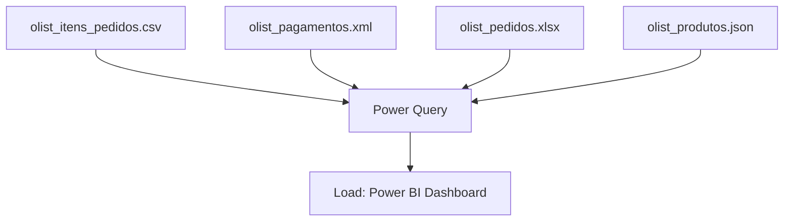

# Olist Ecommerce ETL

[](https://powerbi.microsoft.com/)

## Table of Contents

- [Context](#-context)
- [Software features](#-software-features)
- [Technologies and tools](#-technologies-and-tools)
- [Architecture](#-architecture)
- [Repository structure](#-repository-structure)
- [Requirements](#-requirements)
- [How to run](#-how-to-run)
- [Author](#-author)

# 📌 Context 

This project implements an ETL (Extract, Transform, Load) process developed entirely inside Power BI. It processes e-commerce data from Olist, extracting it from different file formats, transforming it using Power Query, and loading it into a data model for analysis.

## 🚀 Software features

- Base structure configured
- Modular file organization
- Extract, Transform, Load (ETL) processing from multiple sources (CSV, XML, Excel, JSON)
- Data modeling and relationships configured

## 🛠️ Technologies and tools

- Power BI (Power Query / DAX)

## 📋 Architecture



## 📂 Repository structure

```text
- 📂 bi-olist-ecommerce-etl/
  - 📄 etl_no_powerbi.pbix
  - 📂 bases/
    - 📄 olist_itens_pedidos.csv
    - 📄 olist_pagamentos.xml
    - 📄 olist_pedidos.xlsx
    - 📄 olist_produtos.json
    - 📄 tradução.csv
```

## 📦 Requirements

- Power BI Desktop

## ⚙️ How to run

### 1. Clone the Repository
Clone the repository to your local machine:
```bash
git clone https://github.com/MatheusRodri/bi-olist-ecommerce-etl.git
cd bi-olist-ecommerce-etl
```

### 2. Prerequisites
Ensure you have Power BI Desktop installed on your machine.

### 3. Open the Project
1. Open the Power BI dashboard file (`etl_no_powerbi.pbix`).
2. The initial load might show a path error since the data source points to local absolute paths.
3. Update the source paths:
   - Go to **Transform Data** -> **Data source settings**.
   - Change the source for each file to point to the correct path in the local `bases/` directory.
   - Click **Close & Apply** to run the ETL process and refresh the dataset.

## 👤 Author

Matheus Rodrigues 
[LinkedIn](https://linkedin.com/in/matheus-rodrigues-mrj) [GitHub](https://github.com/MatheusRodri)